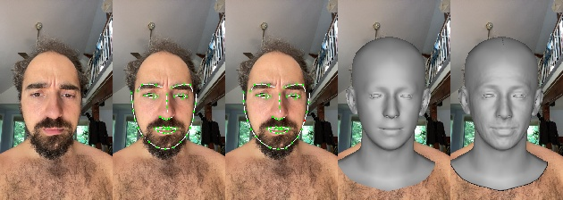

# MH_Animation_tools [Colab](https://colab.research.google.com/drive/1k1NzJgr4hZPF3HgmIkYtRxYtDmBrOlPU?usp=sharing)

iPhone
- DEPTH
  - depth_000254.exr
  - depth_000286.exr
  - depth_000302.exr
  - depth_000461.exr
- RBG
  - video_000254.jpg
  - video_000286.jpg
  - video_000302.jpg
  - video_000461.jpg

    
iPhone_clone
- DEPTH
  - depth_000000.exr
  - video_000000_depth.jpg (predict from DECA)
- RBG
  - video_000000.jpg
  - video_000255.jpg (Tín clone)
  - video_000287.jpg (Tín clone)
  - video_000303.jpg (Tín clone)
  - video_000462.jpg (Tín clone)
 
Thứ tự: 
- iPhone_clone/RBG/video_000000.jpg - iPhone_clone/DEPTH/depth_000000.exr - iPhone_clone/DEPTH/video_000000_depth.jpg

